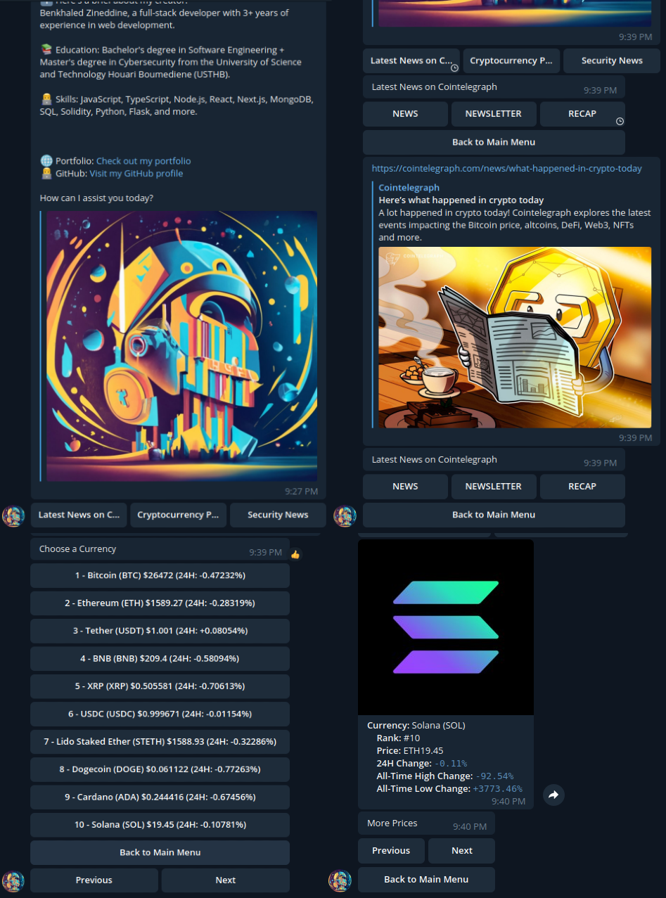

# Cryptomium Bot

Cryptomium Bot is a Telegram bot that provides the latest cryptocurrency news and market data to users. This bot is designed to keep crypto enthusiasts informed about the rapidly changing world of cryptocurrencies. It offers features such as news categorization, cryptocurrency price tracking, and more.

## Table of Contents

- [Features](#features)
- [Getting Started](#getting-started)
  - [Prerequisites](#prerequisites)
  - [Installation](#installation)
- [Usage](#usage)
  - [Bot Commands](#bot-commands)
- [Deployment](#deployment)
  - [Hosting Options](#hosting-options)
- [Contributing](#contributing)
- [License](#license)
- [Acknowledgments](#acknowledgments)

## Features 🚀

- Latest News 📰: Get the latest cryptocurrency news from popular sources.
- News by Category 📑: Filter news articles by specific categories.
- Security News 🔒: Stay informed about security-related news in the crypto space.
- Cryptocurrency Prices 💰: Track cryptocurrency prices, including 24-hour price changes.
- Currency Information 💵: View detailed information about individual cryptocurrencies.
- Pagination 📄: Navigate through multiple pages of cryptocurrency price data.
- More Features Coming Soon! 🚀

## Getting Started ⌨️

### Prerequisites 🧾

Before you can run Cryptomium Bot, make sure you have the following software and resources installed:

- Node.js: [Download Node.js](https://nodejs.org/)
- npm (Node Package Manager): Typically installed with Node.js.
- Telegram Bot Token: Create a bot on Telegram and obtain the API token.

### Installation 📦

1.  Clone the repository:

    `git clone https://github.com/ZineddineBk09/cryptomium-bot/`

2.  Navigate to the project directory:

    `cd cryptomium-bot`

3.  Install dependencies:

    `npm install`

4.  Create a `.env` file in the project root directory and add your Telegram bot token:

    `TELEGRAM_BOT_TOKEN=your-bot-token-here`

## Usage 👨‍💻

To run Cryptomium Bot, use the following command:

`npm start`

### Bot Commands 🤖

- /start: Start a conversation with the bot and access the main menu.
- /latest_news: View the latest cryptocurrency news.
- /crypto_prices: Access cryptocurrency price information.
- /security_news: Get the latest security news related to cryptocurrencies.
- /help: Display a help message with available commands.

## Deployment 🚀

You can deploy Cryptomium Bot using various hosting options. Choose the one that suits your requirements:

### Hosting Options 📡

1.  Self-hosting on a VPS:

    - Rent a Virtual Private Server (VPS) from a provider (e.g., AWS, DigitalOcean).
    - Install Node.js and dependencies.
    - Transfer your project files.
    - Start the bot and keep it running.

2.  Cloud Platforms:

    - Deploy your bot on cloud platforms (e.g., Heroku, Google Cloud, Azure).
    - Configure deployment pipelines for automatic updates.

3.  Serverless Functions:

    - Use serverless platforms (e.g., AWS Lambda, Google Cloud Functions) for simple bots.

4.  Containerization and Orchestration:

    - Containerize your bot with Docker.
    - Orchestrate containers with Kubernetes or Docker Compose for complex projects.

5.  Free Hosting (Ideal for Testing):

    - Use free hosting services (e.g., Render, Glitch, Repl.it) for simple bots.
    - For this bot i used [Render](https://render.com/)

## Contributing 📋

Contributions to this project are welcome! If you have ideas for improvements or want to report issues, please open an issue or create a pull request.

## License 📄

This project is licensed under the [ISC License](https://opensource.org/licenses/ISC).

## Acknowledgments 🏅

- Special thanks to [Zineddine Benkhaled](@ZineddineBk09) for creating this bot.
